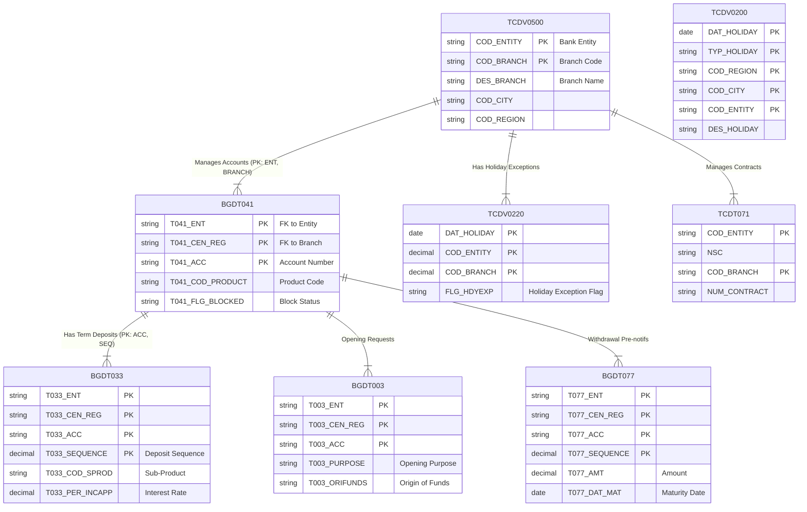

# COBOL Code Analysis & Data Structure

## 1. Data Structure Analysis
The system appears to be a Banking/Inventory application (likely Alnova framework) structured around **Entities**, **Branches (Centers)**, and **Accounts**.

*   **Table Prefixes**:
    *   `BGDT...` (Business Global Data Table): Functional data like Accounts, Deposits, Requests.
    *   `TCDV...` / `TCDT...` (Technical Common Data Table/View): Reference data like Branches, Holidays, System Parameters.

## 2. Identified Joins (Implicit & Explicit)
Most "joins" in this COBOL code are **implicit**, handled by the application logic using common keys across tables rather than single SQL `JOIN` statements. The primary keys linking these tables are:
*   **Entity** (`COD_ENTITY`, `Txxx_ENT`)
*   **Branch/Center** (`COD_BRANCH`, `CEN_REG`, `Txxx_CEN_REG`)
*   **Account Number** (`Txxx_ACC`)

## 3. Entity Relationship Diagram (ERD)
The diagram below illustrates the relationships.
*   **`TCDV0500` (Branch)** is the master table for organizational units.
*   **`BGDT041` (Account)** is the central master table for customer products, linked to the Branch.
*   **`BGDT033` (Term Deposit)**, **`BGDT077` (Pre-notification)**, and **`BGDT003` (Open Request)** are child tables of the Account.

## 4. Table Dictionary
| Table Name | Description | Key Relationships |
| :--- | :--- | :--- |
| **TCDV0500** | **Branch / Center Table** | Master table for Branches. |
| **BGDT041** | **Master Table of Accounts** | Links to `TCDV0500` via Entity/Branch. Parent of all product tables. |
| **BGDT033** | **Term Deposits** | Child of `BGDT041`. Contains specific Term Deposit details (Interest, Renewal). |
| **BGDT003** | **Opening Request** | Stores requests to open new accounts/products. |
| **BGDT077** | **Pre-notifications** | Tracks withdrawal pre-notifications for accounts. |
| **BGDT016** | **Commissions** | Parameters for calculation of commissions. |
| **TCDV0200** | **Holidays** | General calendar of holidays by City/Region. |
| **TCDV0220** | **Holiday Exceptions** | Branch-specific overrides to the general holiday calendar. |
