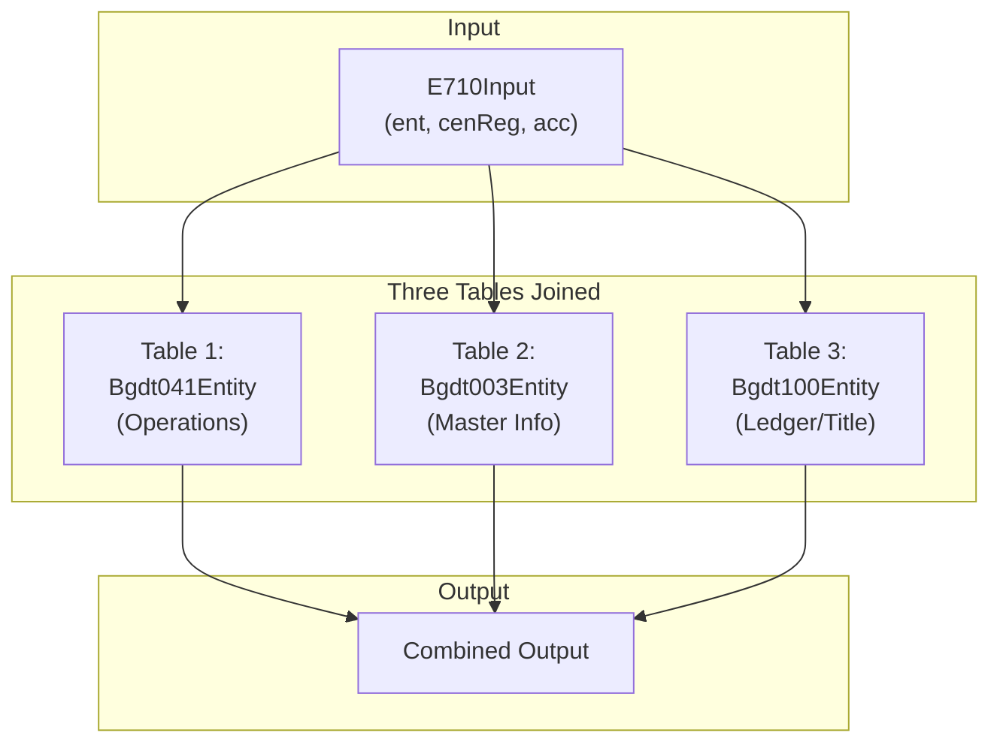
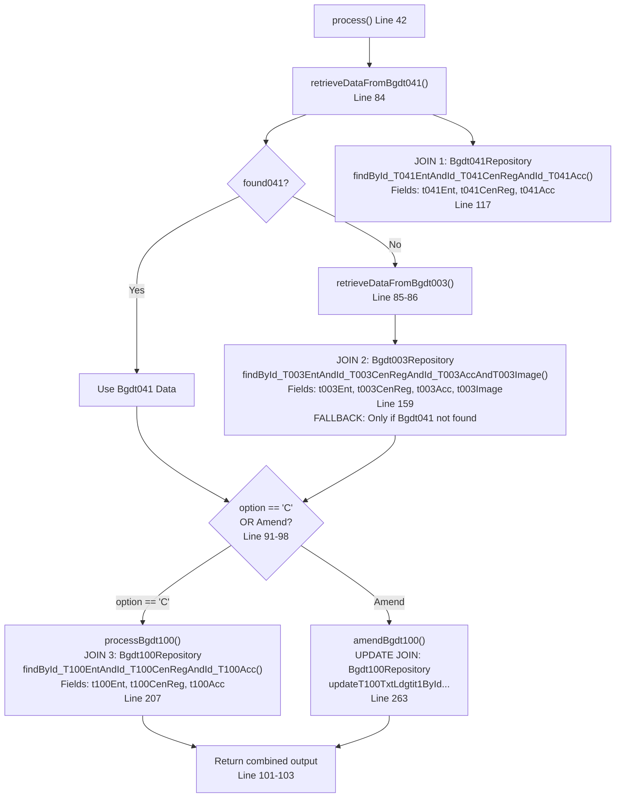
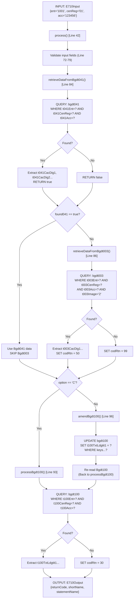

# Multi-Table Join Analysis

## Definition of Multi-Table Join
A join operation that combines data from **3 or more entities** in a single business logic flow.

---

## PRIMARY MULTI-TABLE JOIN: Bg9c7100Service.process()

**File**: `src/main/java/com/example/project/service/Bg9c7100Service.java`

**Method**: `process()` - **Line 42-104**

### Multi-Table Join Pattern



### Flow Diagram



### Code Structure

```java
42  | public E710Output process(E710Input input) {
    |
84  |     boolean found041 = retrieveDataFromBgdt041(input, output);
    |                        ↓ JOIN 1: BGDT041
    |
85  |     if (!found041) {
86  |         retrieveDataFromBgdt003(input, output, vaSwitches, vaVariables, constants);
    |         ↓ JOIN 2: BGDT003 (FALLBACK)
87  |     }
    |
91  |     if (e710Option.equals(constants.getCaC())) {
93  |         processBgdt100(input, output, vaSwitches, vaVariables, constants);
    |         ↓ JOIN 3: BGDT100
94  |     } else {
96  |         amendBgdt100(input, output, vaSwitches, vaVariables, constants);
    |         ↓ UPDATE JOIN: BGDT100
97  |     }
    |
101 |     output.setReturnCode(String.valueOf(vaVariables.getCodRtn()));
102 |     log.info("Output Return code value {}",vaVariables.getCodRtn());
103 |     return output;
104 | }
```

---

## JOIN SEQUENCE IN DETAIL

### JOIN 1: Bgdt041Entity (Primary Account Operations)
**Location**: Line 117 in `retrieveDataFromBgdt041()`

```java
106 | private boolean retrieveDataFromBgdt041(E710Input input, E710Output output) {
    |     ...
117 |     Optional<Bgdt041Entity> entity = bgdt041Repository.findById_T041EntAndId_T041CenRegAndId_T041Acc(
118 |             input.getCac().getEnt(),              // Key 1: Entity Code
119 |             input.getCac().getCenReg(),            // Key 2: Center/Region
120 |             input.getCac().getAcc());              // Key 3: Account Number
    |
121 |     log.info("Retrieve data from Bgdt041Entity {}", entity);
122 |     bgvc041.setV041CacDig1(entity.get().getT041CacDig1());
123 |     bgvc041.setV041CacDig2(entity.get().getT041CacDig2());
124 |     bgvc041.getV041Status().setV041SwFlgStatus(entity.get().getT041FlgStatus());
    |     if (entity.isPresent()) {
125 |         return true;  // FOUND ✓
    |     } else {
132 |         return false; // NOT FOUND → Try Bgdt003
    |     }
133 | }
```

**Join Details**:
- **Entity**: Bgdt041Entity (Account Operations table)
- **Keys**: Composite 3-field key (t041Ent, t041CenReg, t041Acc)
- **Fields Retrieved**: t041CacDig1, t041CacDig2, t041FlgStatus
- **Related Fields (Foreign Keys)**:
  - t041CodProduct (Line 29) → Product Master (Bgdt016)
  - t041CodSprod (Line 30) → Sub-product (Bgdt033)
  - t041Fcc (Line 90) → Currency (Tcdv0800)

---

### JOIN 2: Bgdt003Entity (Master Account Info) - FALLBACK
**Location**: Line 159 in `retrieveDataFromBgdt003()`

```java
148 | private void retrieveDataFromBgdt003(E710Input input, E710Output output, 
    |     VaSwitches vaSwitches, VaVariables vaVariables, VaConstants constants) {
    |
159 |     Optional<Bgdt003Entity> entity = bgdt003Repository.findById_T003EntAndId_T003CenRegAndId_T003AccAndT003Image(
160 |             input.getCac().getEnt(),              // Key 1: Entity Code
161 |             input.getCac().getCenReg(),            // Key 2: Center/Region
162 |             input.getCac().getAcc(),               // Key 3: Account Number
    |             "2");                                  // Key 4: Image (Filter)
    |
163 |     log.info("Retrieve data from Bgdt003Entity {}", entity);
164 |     bgvc003.setCacDig1(entity.get().getT003CacDig1());
165 |     bgvc003.setCacDig2(entity.get().getT003CacDig2());
    |
    |     if (entity.isPresent()) {
167 |         // Process successful
168 |         vaVariables.setCodRtn(50);
169 |     } else {
175 |         vaVariables.setCodRtn(99); // Error
176 |     }
177 | }
```

**Join Details**:
- **Entity**: Bgdt003Entity (Master Account Info table)
- **Keys**: Composite 4-field key (t003Ent, t003CenReg, t003Acc, t003Image)
- **Trigger**: Only called if JOIN 1 (Bgdt041) returns NOT FOUND
- **Fields Retrieved**: t003CacDig1, t003CacDig2
- **Related Fields (Foreign Keys)**:
  - t003CodProduct (Line 31) → Product Master (Bgdt016)
  - t003CodSprod (Line 32) → Sub-product (Bgdt033)
  - t003Fcc (Line 60) → Currency (Tcdv0800)

---

### JOIN 3: Bgdt100Entity (Account Ledger/Title) - CREATE
**Location**: Line 207 in `processBgdt100()`

```java
195 | private void processBgdt100(E710Input input, E710Output output, 
    |     VaSwitches vaSwitches, VaVariables vaVariables, VaConstants constants) {
    |
207 |     Optional<Bgdt100Entity> entity = bgdt100Repository.findById_T100EntAndId_T100CenRegAndId_T100Acc(
208 |             input.getCac().getEnt(),              // Key 1: Entity Code
209 |             input.getCac().getCenReg(),           // Key 2: Center/Region
210 |             input.getCac().getAcc());             // Key 3: Account Number
    |
211 |     log.info("Retrieve data from Bgdt100Entity {}", entity);
212 |     V100Txt txt = new V100Txt();
213 |     txt.setV100TxtLdgtit1(entity.get().getT100TxtLdgtit1());
214 |     txt.setV100TxtLdgtit2(entity.get().getT100TxtLdgtit2());
215 |     txt.setV100TxtLdgtit3(entity.get().getT100TxtLdgtit3());
    |
    |     if (entity.isPresent()) {
216 |         output.setShortName(bgvc100.getV100Txt().getV100TxtLdgtit1());
217 |         output.setStatementName(
218 |             bgvc100.getV100Txt().getV100TxtLdgtit2().substring(0, 35) +
219 |             bgvc100.getV100Txt().getV100TxtLdgtit3().substring(0, 35));
220 |     }
221 | }
```

**Join Details**:
- **Entity**: Bgdt100Entity (Account Ledger/Title table)
- **Keys**: Composite 3-field key (t100Ent, t100CenReg, t100Acc)
- **Fields Retrieved**: t100TxtLdgtit1, t100TxtLdgtit2, t100TxtLdgtit3
- **Purpose**: Fetch account title/ledger information

---

### JOIN 4: Bgdt100Entity (Account Ledger/Title) - UPDATE
**Location**: Line 263 in `amendBgdt100()`

```java
249 | private void amendBgdt100(E710Input input, E710Output output,
    |     VaSwitches vaSwitches, VaVariables vaVariables, VaConstants constants) {
    |
263 |     int updatedRows = bgdt100Repository.updateT100TxtLdgtit1ById_T100EntAndId_T100CenRegAndId_T100Acc(
264 |             bgvc100.getV100Txt().getV100TxtLdgtit1(), // New value
265 |             bgvc100.getV100CodKey().getV100Cac().getV100Ent(),     // Key 1: Entity
266 |             bgvc100.getV100CodKey().getV100Cac().getV100CenReg(),   // Key 2: Center/Region
267 |             bgvc100.getV100CodKey().getV100Cac().getV100Acc());     // Key 3: Account
    |
    |     if (updatedRows == 0) {
270 |         vaVariables.setCodRtn(99); // Error: No rows updated
271 |     } else {
274 |         processBgdt100(input, output, ...); // Re-read after update
275 |     }
276 | }
```

**Join Details**:
- **Entity**: Bgdt100Entity (Update operation)
- **Keys**: Composite 3-field key (t100Ent, t100CenReg, t100Acc)
- **Operation**: UPDATE SET t100TxtLdgtit1 = ? WHERE (composite key)
- **Purpose**: Amend account title information

---

## SECONDARY MULTI-TABLE JOIN: Bg4c5170Service

**File**: `src/main/java/com/example/project/service/Bg4c5170Service.java`

### Multi-Table Join Sequence

#### JOIN 1: Bgdt041Entity
**Location**: Line 3504

```java
3502 | //Optional<Bgdt041Entity> bgdt041Entity = bgdt041Repository.findByT041EntAndT041CenRegAndT041Acc(
3503 | //      f074Key.getF074Cac().getF074Ent(), f074Key.getF074Cac().getF074CenRegistration(), f074Key.getF074Cac().getF074Acc());
3504 | Optional<Bgdt041Entity> bgdt041Entity = bgdt041Repository.findById_T041EntAndId_T041CenRegAndId_T041Acc(
3505 |         f074Key.getF074Cac().getF074Ent(),           // Entity
3506 |         f074Key.getF074Cac().getF074CenRegistration(), // Center/Region
3507 |         f074Key.getF074Cac().getF074Acc());           // Account
```

---

#### JOIN 2: Bgdt033Entity
**Location**: Line 3578

```java
3577 | //Optional<Bgdt033Entity> bgdt033Entity = bgdt033Repository.findByEntAndCenRegAndAccAndSequence(
3578 | Optional<Bgdt033Entity> bgdt033Entity = bgdt033Repository.findById_EntAndId_CenRegAndId_AccAndId_Sequence(
3579 |         entity,                      // Entity
3580 |         centralRegistry,             // Center/Registry
3581 |         accountNumber,               // Account
3582 |         sequenceNumber);             // Sequence (4-field composite key)
    |
3583 | if (bgdt033Entity != null && !bgdt033Entity.isEmpty()) {
3584 |     workingStorageModel.getVaDetPvm().setVaTax(bgdt033Entity.get().getTcr());
3585 | }
```

---

## MULTI-TABLE JOIN PATTERN SUMMARY

### Pattern 1: Fallback Join Pattern
**Used In**: Bg9c7100Service.process()

```mermaid
flowchart TD
    subgraph "MULTI-TABLE JOIN WITH FALLBACK STRATEGY"
        INPUT["Input: (ent, cenReg, acc)"]
        
        INPUT --> STEP1
        
        subgraph STEP1["Step 1: Try JOIN BGDT041 (Account Operations)"]
            Q1["findById_T041EntAndId_T041CenRegAndId_T041Acc()"]
        end
        
        STEP1 --> CHECK1{"Success?"}
        
        CHECK1 -->|"SUCCESS"| USE041["Use Bgdt041 data<br/>Skip Bgdt003"]
        CHECK1 -->|"FAIL"| STEP2
        
        subgraph STEP2["Step 2: Try JOIN BGDT003 (Master Account) - FALLBACK"]
            Q2["findById_T003EntAndId_T003CenRegAndId_T003Acc()"]
        end
        
        STEP2 --> CHECK2{"Success?"}
        
        CHECK2 -->|"SUCCESS"| USE003["Use Bgdt003 data"]
        CHECK2 -->|"FAIL"| ERROR["Error (codRtn = 99)"]
        
        USE041 --> STEP3
        USE003 --> STEP3
        
        subgraph STEP3["Step 3: JOIN BGDT100 (Ledger/Title) - ALWAYS"]
            Q3["findById_T100EntAndId_T100CenRegAndId_T100Acc()"]
        end
        
        STEP3 --> COMBINE["Combine with Bgdt041/Bgdt003 data"]
        
        COMBINE --> OUTPUT["Output: Combined E710Output"]
    end
```



---

## ENTITIES INVOLVED IN MULTI-TABLE JOINS

### Direct Join Entities

| Entity | Table | Join Fields | Purpose |
|--------|-------|------------|---------|
| **Bgdt041Entity** | bgdt041 | t041Ent, t041CenReg, t041Acc | Account Operations (PRIMARY) |
| **Bgdt003Entity** | bgdt003 | t003Ent, t003CenReg, t003Acc, t003Image | Master Account (FALLBACK) |
| **Bgdt100Entity** | bgdt100 | t100Ent, t100CenReg, t100Acc | Ledger/Title (SECONDARY) |

### Related Foreign Key Entities (Potential Cascade Joins)

| Entity | Table | Join With | Purpose |
|--------|-------|-----------|---------|
| **Bgdt016Entity** | bgdt016 | Bgdt041/Bgdt003 | Product Master |
| **Bgdt033Entity** | bgdt033 | Bgdt041/Bgdt003 | Sub-product Details |
| **Tcdv0800Entity** | tcdv0800 | Bgdt041/Bgdt003 | Currency/FCC Master |

---

## IMPLICIT CASCADE JOIN RELATIONSHIPS

### Potential 5+ Entity Join Chain

```
Bgdt041Entity (Operations)
    │
    ├─► t041CodProduct ──► Bgdt016Entity (Product)
    │       │
    │       └─► t016Fcc ──► Tcdv0800Entity (Currency)
    │
    ├─► t041CodSprod ──► Bgdt033Entity (Sub-product)
    │
    └─► t041Fcc ──► Tcdv0800Entity (Currency)

Total Potential Join Depth: 5 entities
```

---

## CODE FLOW VISUALIZATION: Multi-Table Join in Bg9c7100Service



---

## SUMMARY: Multi-Table Joins Identified

| Join Location | Service Class | Method | Line # | Tables Joined | Join Type |
|---|---|---|---|---|---|
| **PRIMARY** | Bg9c7100Service | process() | 42-104 | Bgdt041 → Bgdt003 → Bgdt100 | Fallback Pattern |
| **JOIN 1** | Bg9c7100Service | retrieveDataFromBgdt041() | 106-146 | Bgdt041 | Primary Join |
| **JOIN 2** | Bg9c7100Service | retrieveDataFromBgdt003() | 148-193 | Bgdt003 | Fallback Join |
| **JOIN 3** | Bg9c7100Service | processBgdt100() | 195-247 | Bgdt100 | Secondary Join |
| **JOIN 4** | Bg9c7100Service | amendBgdt100() | 249-288 | Bgdt100 | Update Join |
| **SECONDARY** | Bg4c5170Service | retrieveManagementSector() | 3489-3522 | Bgdt041 | Operational Join |
| **TERTIARY** | Bg4c5170Service | retrieveTaxCodeRate() | 3571-3591 | Bgdt033 | Tax Join |

---

## KEY FINDINGS

✅ **3+ Entity Multi-Table Joins Confirmed**
- Bgdt041Entity (Operations)
- Bgdt003Entity (Master)
- Bgdt100Entity (Ledger)

✅ **Fallback Join Strategy**
- Try Bgdt041 first (PRIMARY)
- Fall back to Bgdt003 if not found
- Always join Bgdt100 (SECONDARY)

✅ **Composite Key Pattern**
- 3-field: (ent, cenReg, acc)
- 4-field: (ent, cenReg, acc, image/sequence)

✅ **Related Foreign Key Entities**
- Bgdt016 (Product Master)
- Bgdt033 (Sub-product)
- Tcdv0800 (Currency Master)

✅ **Service Orchestration**
- Bg9c7100Service: Main multi-table join orchestrator
- Bg4c5170Service: Calls Bg9c7100Service + other services

