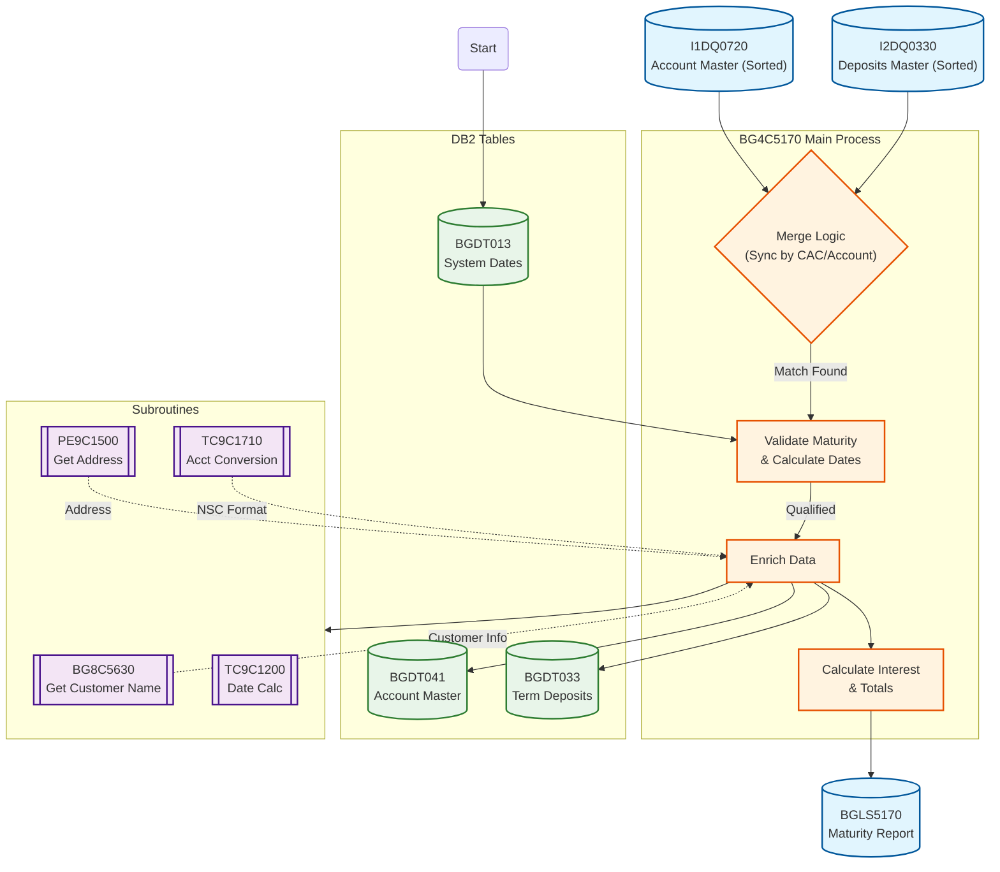
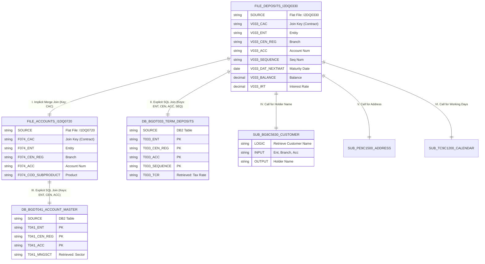
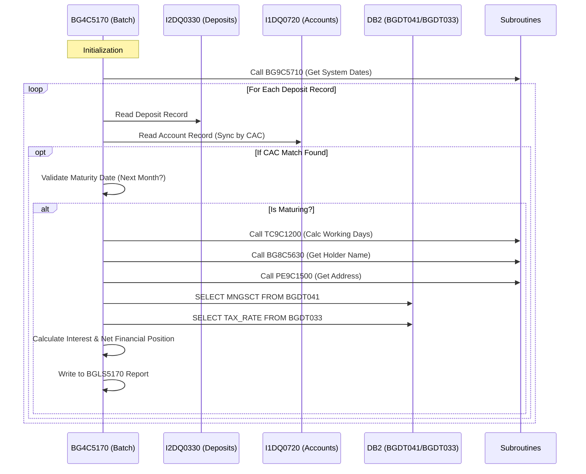

# BG4C5170 Batch Analysis: Term Deposit Maturity Report

This document outlines the data flow, entity relationships, and processing logic for the batch program `BG4C5170`, which generates the listing of term deposits maturing in the following month.

## 1. System Data Flow Diagram
This flowchart illustrates the high-level data movement, from input files through the synchronization process and enrichment to the final report output.

## 2. Entity Relationship & Joins Diagram (ERD)
This diagram details the specific technical relationships between the input files (acting as driving tables) and the DB2 tables/Subroutines accessed during the batch execution. Connections represent the specific "joins" or lookups performed.

## 3. Processing Sequence Diagram
This diagram shows the step-by-step logical execution for a single matching record.

## 4. Detailed Join Analysis

The program utilizes a combination of file-based merge joins and explicit SQL database joins.

### A. Implicit File Join (Merge Join)
The core processing loop relies on a synchronized read of two sorted input files.
*   **Source 1:** `DEPOSITS-FILE` (`I2DQ0330`) - Driven by paragraph `13000-READ-DEPOSIT`.
*   **Source 2:** `ACC-IFCTDA-FILE` (`I1DQ0720`) - Driven by paragraph `14000-SELECT-RECORD`.
*   **Join Condition:** `I2DQ0330.CAC = I1DQ0720.CAC` (Where CAC is the Contract/Account Code).
*   **Logic:** The system iterates through the Deposit file and acts as a driver, advancing the Account file pointer until the CAC keys match.

### B. Explicit DB2 Table Joins
When a file record is processed, specific data elements are retrieved from DB2 using explicit `SELECT` statements (Nested Loop Join pattern).

| Target Table | Logic Paragraph | Join Keys (WHERE Clause) | Purpose |
| :--- | :--- | :--- | :--- |
| **BGDT041** (Account Master) | `21150-ACCESS-MNGSCT` | `ENT`, `CEN-REG`, `ACC` | Retrieves the Management Sector (`MNGSCT`) for the account. |
| **BGDT033** (Term Deposits) | `21160-SELECT-TAX` | `ENT`, `CEN-REG`, `ACC`, `SEQUENCE` | Retrieves the Tax Rate (`TCR`) specific to the deposit sequence. |

### C. Functional / Subroutine Joins
External subroutines are called to "join" to other functional areas (Customer, Address, etc.) without direct table access in this program.

| Subroutine | Logical Entity | Join/Input Keys | Returns |
| :--- | :--- | :--- | :--- |
| **BG8C5630** | Customer/Person | `ENT`, `CEN`, `ACC` | Account Holder Name (resolved for Individual vs Legal Entity). |
| **PE9C1500** | Address | `ENT`, `CEN`, `PROD`, `ACC` | Physical Address for the account. |
| **TC9C1710** | System Keys | `ENT`, `CEN`, `ACC` | NSC (National Sort Code) mapping. |
| **TC9C1200** | Calendar | `Date`, `Branch` | Working day calculations (Holiday checks). |
| **BG9C5710** | System Config | `Entity` | System closing dates (via `BGDT013`). |

