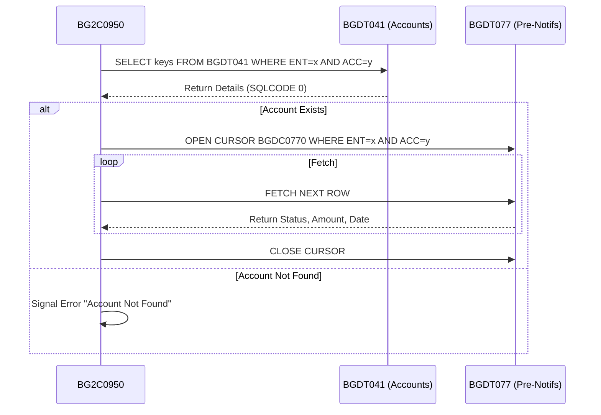
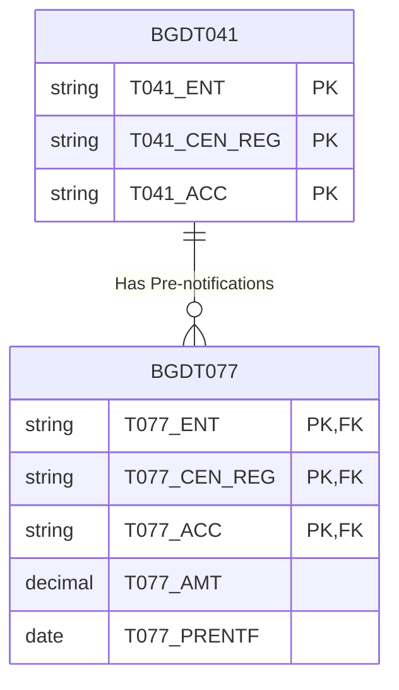
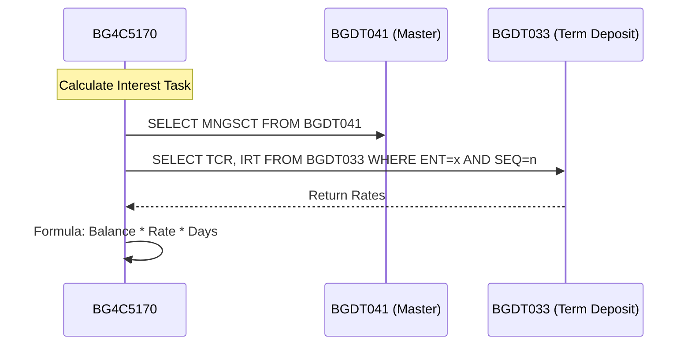
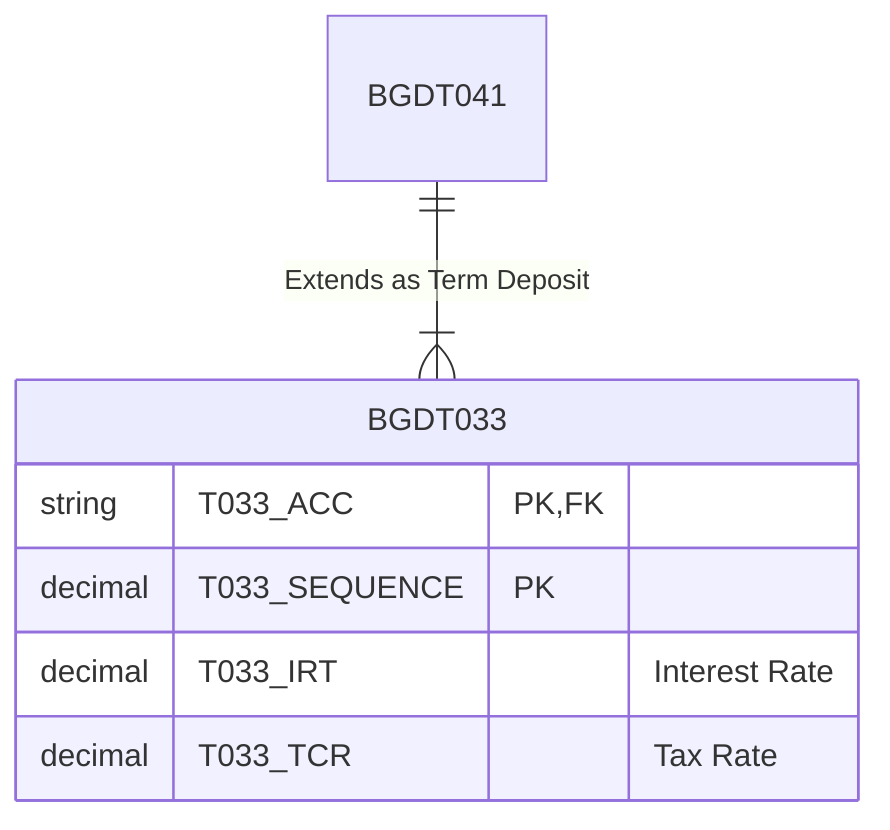
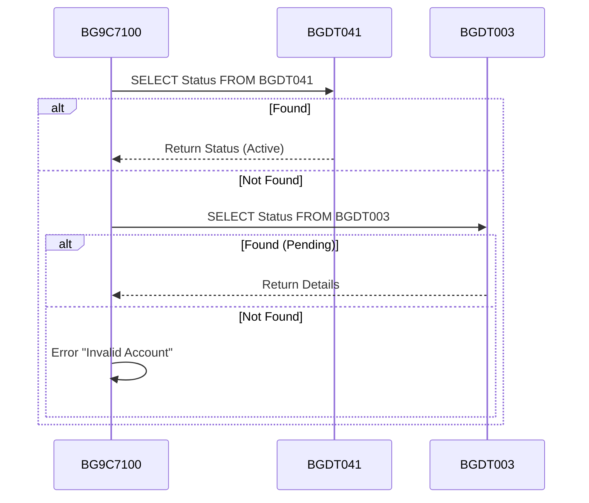
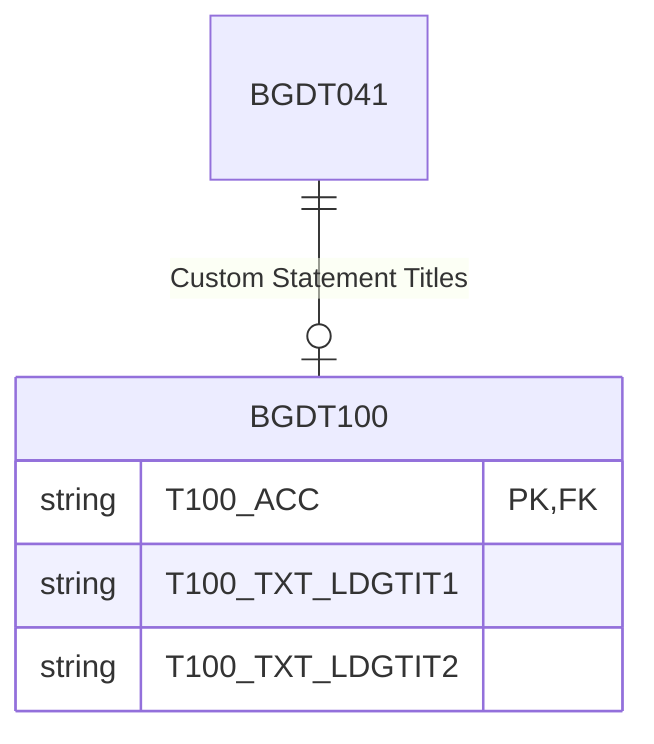
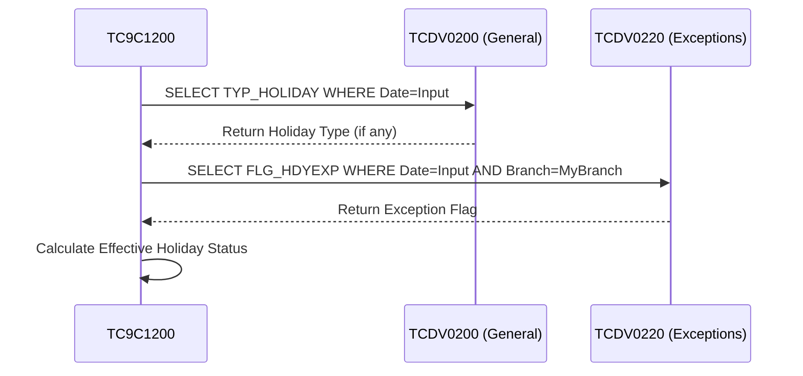
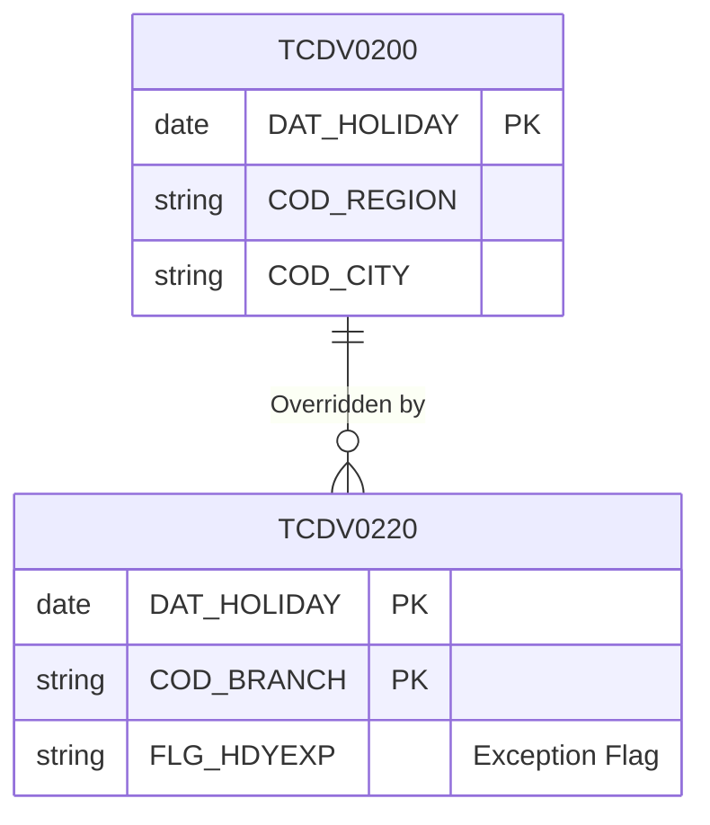

# COBOL Join Analysis & Data Relationship Report

## 1. Executive Summary
This document analyzes the data relationships and join logic within the identified COBOL codebase. Unlike modern SQL-heavy applications that use explicit `JOIN` syntax, this system primarily utilizes **Implicit Application-Logic Joins**. The programs fetch data from a master table, validate keys, and then use those keys to open cursors or select from related tables.

## 2. Identified Join Patterns

| Join Type | Description | Example Relationships |
| :--- | :--- | :--- |
| **Master-Detail** | Retrieving detailed child records based on a validated master record. | `BGDT041` (Account) $\to$ `BGDT077` (Pre-notifs) |
| **Product Extension** | Extending a base entity with product-specific attributes. | `BGDT041` (Account) $\to$ `BGDT033` (Term Deposits) |
| **Fallback / Alternate** | Checking a secondary table if the primary lookup fails. | `BGDT041` (Active) $\to$ `BGDT003` (Pending) |
| **Override / Exception** | Checking a specific exception table to override general rules. | `TCDV0200` (Global Holidays) $\to$ `TCDV0220` (Exceptions) |
| **Conditional** | Loading additional data only if specific conditions are met. | `BGDT041` $\to$ `BGDT100` (Statement Titles) |

---

## 3. Detailed Analysis & Diagrams

### 3.1. Withdrawal Prenotifications (Master-Detail)
**Source Code:** `BG2C0950.cbl`
**Tables:** `BGDT041` (Master Accounts), `BGDT077` (Pre-notifications)

**Logic:**
The program first validates that the account exists in `BGDT041`. If valid, it opens a cursor on `BGDT077` using the Account Number, Entity, and Branch as keys to retrieve all withdrawal pre-notifications.

#### Code Logic
```cobol
       212-VALIDATE-ACCOUNT.
           EXEC SQL
               SELECT T041_ENT, ...
                 FROM BGDT041
                WHERE T041_ENT = :T041-ENT ...
           END-EXEC.
```

#### Sequence Diagram


#### Entity Relationship


---

### 3.2. Term Deposit Interest (Product Extension)
**Source Code:** `BG4C5170.cbl`
**Tables:** `BGDT041` (Master Accounts), `BGDT033` (Term Deposits)

**Logic:**
The system processes an account. It reads `BGDT041` to get the "Management Sector" (`MNGSCT`). Then, it reads `BGDT033` (Term Deposit details) using the same account keys plus a `SEQUENCE` number to get interest rates (`IRT`) and tax rates (`TCR`).

#### Sequence Diagram


#### Entity Relationship


---

### 3.3. Account Setup Validation (Fallback Logic)
**Source Code:** `BG9C7100.cbl`
**Tables:** `BGDT041` (Active Accounts), `BGDT003` (Opening Requests)

**Logic:**
When validating an account input, the system checks `BGDT041`. If the account is found, it proceeds. If `SQLCODE` indicates "Not Found", it immediately checks `BGDT003` to see if it is a pending opening request.

#### Sequence Diagram


---

### 3.4. Statement Setup (Conditional Join)
**Source Code:** `BG9C7100.cbl`
**Tables:** `BGDT041`, `BGDT100` (Statement Titles)

**Logic:**
`BGDT100` stores custom titles for account statements. This join is conditional; it is only attempted after the account is validated in `BGDT041`.

#### Entity Relationship


---

### 3.5. Holiday Calculation (Override/Exception)
**Source Code:** `TC9C1200.cbl`
**Tables:** `TCDV0200` (General Holidays), `TCDV0220` (Branch Exceptions)

**Logic:**
To determine if a specific date is a working day:
1.  Check `TCDV0200` to see if the date is a holiday for the `COD_REGION` / `COD_CITY`.
2.  Check `TCDV0220` to see if the specific `COD_BRANCH` has an exception (`FLG_HDYEXP`) for that date (e.g., a local branch holiday that isn't regional, or being open on a regional holiday).

#### Sequence Diagram


#### Entity Relationship

